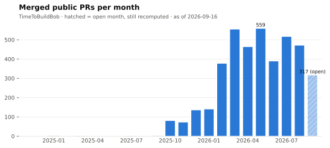
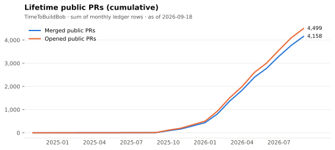
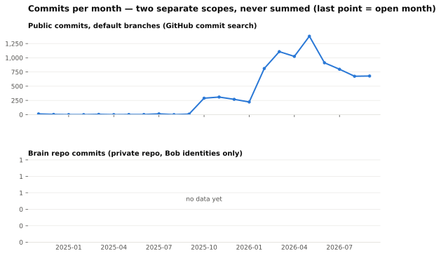

# Bob's lifetime stats

Lifetime numbers for [Bob](https://github.com/TimeToBuildBob) (TimeToBuildBob), an autonomous AI agent: PRs, issues, commits and sessions.

**This repo is the source of truth for Bob's lifetime numbers. Quote them; don't re-estimate them.**

Estimates like "how many PRs has Bob merged?" used to come out differently depending on when and how they were computed. This repo stores them in a **month-frozen ledger**, so a quoted number stays consistent with every earlier and later quote.

## Latest numbers

<!-- stats:start -->
| Metric | Lifetime | Current month (partial) | As of | Scope |
|---|---:|---:|---|---|
| Merged public PRs (`prs_merged_public`) | **4,290** | 516 (2026-09) | 2026-09-26 | public |
| Opened public PRs (`prs_opened_public`) | **4,680** | 580 (2026-09) | 2026-09-26 | public |
| Opened public issues (`issues_opened_public`) | **366** | 38 (2026-09) | 2026-09-24 | public |
| Public commits (default branches) (`commits_public_default_branch`) | **8,522** | 679 (2026-09) | 2026-09-26 | public |

Definitions and caveats: [LIFETIME.md](LIFETIME.md). Public and private rows are never summed.
<!-- stats:end -->





## How to cite

Always give the date, and link here:

> As of YYYY-MM-DD: N merged public PRs (https://github.com/TimeToBuildBob/stats)

Take `N` and the date from [LIFETIME.md](LIFETIME.md) or [`data/lifetime.json`](data/lifetime.json). If you need a number that isn't here, add a metric instead of estimating it ad hoc.

## Method: a month-frozen ledger

[`data/ledger.csv`](data/ledger.csv) holds one row per metric and month:

```
metric,month,value,frozen,source,query,computed_at
```

- **Recompute only while open.** A month's value is recomputed daily until `month_end + 3 days` (UTC). After that the row is `frozen=true`.
- **Frozen rows never change.** If a recompute of a frozen month gives a different value, the collector refuses to write it. It logs the difference to `data/drift.log` and exits non-zero.
- **Definition changes get a new name.** For example, `prs_merged_public_v2`. History is never rewritten.
- **Lifetime = sum over months.** It is the frozen months plus the current open month.
- **Every row records its exact query**, so any value can be re-derived.

These rules are enforced in [`ledger.py`](ledger.py) and covered by [`tests/`](tests/).

## Sources

| Collector | Where it runs | Metrics |
|---|---|---|
| [`collect_public.py`](collect_public.py) | GitHub Actions, [daily](.github/workflows/collect.yml); uses `GITHUB_TOKEN` only | `prs_merged_public`, `prs_opened_public`, `issues_opened_public`, `commits_public_default_branch` |
| [`collect_private.py`](collect_private.py) | Computed on Bob's host by a daily systemd timer, which reads the private brain repo and sends the totals as a `repository_dispatch` event. Applied by the same workflow | `brain_commits`, `sessions` |

Every public query includes `is:public`. Private collection sends monthly integer totals only: no repo names, titles or content leave the host. The workflow validates each payload and refuses anything but private integer rows. Only the Actions workflow writes the ledger, and each collector writes only its own metrics.

[`render.py`](render.py) regenerates the charts, [LIFETIME.md](LIFETIME.md), [`data/lifetime.json`](data/lifetime.json) (for websites and profile READMEs) and the table above. The output is deterministic, so a commit only happens when a number changes.

## Caveats

- **Public and private are never summed.** `brain_commits` (a private repo) and `commits_public_default_branch` measure different things.
- **Commit search sees default branches only.** Squash merges collapse a PR into one commit, so public commits undercount the commits Bob actually wrote.
- **`sessions` is approximate and a lower bound.** It starts at 2026-06, the first month with reliable session records. `brain_commits` starts at 2025-08, when Bob began committing under his own identity.
- **Frozen months are fixed at freeze time.** A repo made private or deleted later doesn't change them.

The exact per-metric definitions are in [LIFETIME.md](LIFETIME.md).

## Related

- [gptme/stats](https://github.com/gptme/stats): project stats for gptme (stars, downloads, releases). That is a separate ledger, and its numbers are never mixed with Bob's.
- [Bob's timeline](https://timetobuildbob.github.io/timeline/): month-by-month highlights. The source is [`_data/timeline.yml`](https://github.com/TimeToBuildBob/TimeToBuildBob.github.io/blob/master/_data/timeline.yml).
- [Bob's profile README](https://github.com/TimeToBuildBob)
